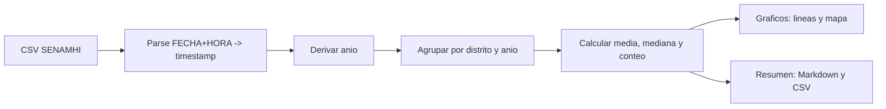

## ¿Qué tan limpio es el aire en la capital?

  

Si has mirado alguna vez el cielo limeño pensando “¿siempre está así de gris?”, no estás solo. Entre garúas tercas, avenidas repletas y puertos hiperactivos, nuestra intuición grita: “esto no puede ser tan limpio”. Pero la intuición no gana debates: los datos sí. Vamos a los números con un dataset de **SENAMHI** que mide la calidad del aire en Lima Metropolitana desde 2015. Vamos a analizar más de medio millón de mediciones diarias para poder llegar a una conclusión certera sobre nuestra pregunta inicial. ¿Coincidirá la intuición con la verdad?
  

---

  

## Ficha técnica

  

### Monitoreo de los contaminantes del aire en Lima Metropolitana

- **Publicado por:** Servicio Nacional de Meteorología e Hidrología del Perú (SENAMHI)

- **Periodo registrado:** 2015–2024

  

**Datos de la estación**

- Nombre, latitud, longitud, altitud

- Departamento, provincia, distrito, ubigeo

  

**Datos del monitoreo de la calidad del aire**

- Fecha, hora

- PM10, PM2.5, NO2

  

**Archivos incluidos**

- Dataset: 577,794 filas y 15 columnas

- Diccionario de datos y metadatos

  

---

  

## Objetivo

Responder con evidencia a una pregunta sencilla: ¿qué tan cargado de **PM10** (partículas gruesas) está el aire de Lima y cómo varía por distrito a lo largo de los años? Además, ubicar en el mapa dónde se concentran los niveles más altos.

  

---

  

## Metodología

- **Fuente de datos:** “Monitoreo de los contaminantes del aire en Lima Metropolitana — SENAMHI”.

- **Preparación:**

- Se construyó un `timestamp` a partir de `FECHA` (YYYYMMDD) y `HORA` (HHMMSS) y se derivó `year`.

- Agregamos por `DISTRITO` y `year`: `pm10_mean` (media), `pm10_median` (mediana) y `pm10_count` (conteo).

- Coordenadas por distrito-año: media de `LATITUD` y `LONGITUD`.

- **Métrica principal:** PM10 medio anual por distrito (µg/m³).

- **Referencia sanitaria en los gráficos:** Guía **OMS**: promedio anual recomendado de PM10 ≈ 20 µg/m³ (línea verde punteada).

  

  

---

  

## Resultados

  

### Tendencia general anual (PM10 medio)

- 2015: 71.2 µg/m³

- 2016: 74.2 µg/m³

- 2017: 74.4 µg/m³

- 2018: 70.2 µg/m³

- 2019: 65.8 µg/m³

- 2020: 55.0 µg/m³

- 2021: 63.8 µg/m³

- 2022: 56.5 µg/m³

- 2023: 39.9 µg/m³

- 2024: 40.8 µg/m³

![[yearly_pm10_by_district_lines.png]]

**Observaciones clave:**

- La curva general baja respecto a 2015–2018 y pega un respiro notorio en 2020 (sí, te estamos mirando, pandemia). 2023–2024 se ven más amables, pero todavía lejos de lo ideal.

- La guía **OMS** (20 µg/m³) queda muy por debajo de nuestros promedios: todavía estamos respirando más de la cuenta.

  

### Mapa de PM10 por distrito (año más reciente)  ![[pm10_map_2024.png]]

Notas del mapa:

- Usamos una escala de color “robusta” (percentiles 5–95) para que un valor extremo no “queme” todo el mapa.
### Distritos destacados (2024)

- Más altos (media anual de PM10):

- San Borja: 68.7 µg/m³ (mediana 56.2, n=3488)

- Carabayllo: 48.7 µg/m³ (mediana 42.8, n=1425)

- San Juan de Lurigancho: 42.2 µg/m³ (mediana 38.9, n=2808)

- San Martín de Porres: 35.2 µg/m³ (mediana 29.6, n=2111)

- Villa María del Triunfo: 30.8 µg/m³ (mediana 26.8, n=2141)

- Santa Anita: 30.5 µg/m³ (mediana 26.9, n=3577)

- Jesús María: 29.5 µg/m³ (mediana 24.7, n=3583)

  

- Más bajos (media anual de PM10):

- Jesús María: 29.5 µg/m³ (mediana 24.7, n=3583)

- Santa Anita: 30.5 µg/m³ (mediana 26.9, n=3577)

- Villa María del Triunfo: 30.8 µg/m³ (mediana 26.8, n=2141)

- San Martín de Porres: 35.2 µg/m³ (mediana 29.6, n=2111)

- San Juan de Lurigancho: 42.2 µg/m³ (mediana 38.9, n=2808)

- Carabayllo: 48.7 µg/m³ (mediana 42.8, n=1425)

- San Borja: 68.7 µg/m³ (mediana 56.2, n=3488)

  

> Nota: “Más altos” y “Más bajos” anteriores se refieren a la selección obtenida con la media anual del último año; los rangos pueden variar si se usa la mediana u otro año.

  

---

  

## Calidad y coherencia

- La **media** anual puede verse afectada por picos puntuales; la **mediana** ofrece robustez. En este análisis se calculan ambas.

- Se requiere un **mínimo de n** (conteo) para considerar un estimado confiable; en el resumen incluimos `pm10_count` por distrito.

- Para el mapa se usa una **escala robusta** (5–95 percentiles), evitando que un único valor extremo “encienda” todo el color.

- Si un distrito luce incoherente entre el mapa y la serie temporal, se sugiere:

- Revisar conteo de muestras (`pm10_count`) y diferencia media–mediana.

- Considerar **mediana** o **promedio recortado** (p.ej., 10%) al priorizar rankings.

- Desagregar por **estación** para identificar si una estación específica eleva el promedio del distrito.

  

---

  

## Recomendaciones

- Priorizar acciones en distritos con PM10 más alto (según mediana/robusto), evaluar fuentes locales (tránsito, construcción, industria).

- Profundizar con series por **estación** y análisis **estacional** (verano/invierno) y por **hora del día**.

- Evaluar cumplimiento respecto a guías OMS (anual y diaria) y normativa local; cuantificar **días excedidos** por año.

- Mejorar cobertura y calibración de sensores; documentar metadatos de mantenimiento y cambios de instrumentación.

  

---

  

## Próximos pasos

- Extender el análisis a **PM2.5** y **NO2** con la misma metodología.

- Incorporar mapas por año o una **animación** de la evolución espacial.

- Publicar un tablero interactivo (p.ej., con Panel/Plotly) para exploración pública.

- Automatizar la generación del reporte (Markdown) a partir del pipeline.

  

---

  

## Referencias y salidas

- Series y promedio general: `outputs/senhami/yearly_pm10_by_district_lines.png`

- Mapa por distritos (2024): `outputs/senhami/pm10_map_2024.png`

- Resumen por distrito-año (CSV): `outputs/senhami/yearly_pm10_by_district.csv`

  

> Fuente: SENAMHI; elaboración propia a partir de datos abiertos.