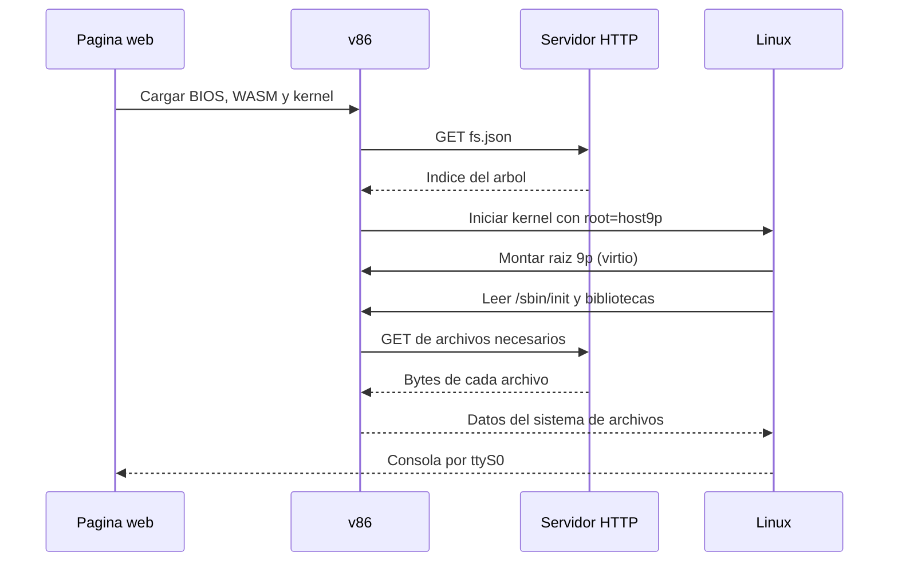
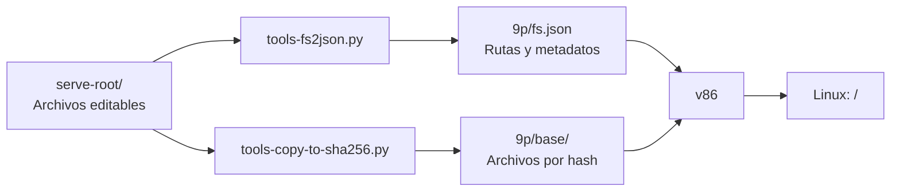
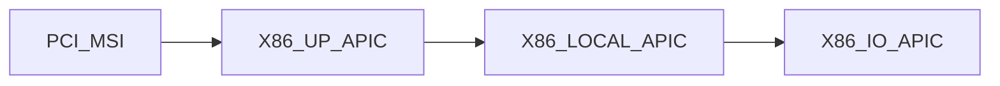

Quería construir un portafolio que se explorara como una máquina virtual real. En vez de una página con secciones sobre mí, el visitante encontraría archivos, leería logs y seguiría pistas desde una terminal. La primera idea era simular un shell: un servidor interpretaría comandos como `ls`, `cat` y `grep` sobre un árbol de contenido cuidadosamente escrito.

Pero había una pregunta incómoda: si la terminal debía sentirse real, ¿por qué no arrancar Linux de verdad en el navegador?

Eso nos llevó a [v86](https://github.com/copy/v86), un emulador de x86 que permite iniciar un kernel dentro de una página web.

<figure>
  
  <figcaption>El catálogo de sistemas de copy.sh/v86. De ahí salió el kernel de Buildroot con el que hicimos la primera prueba de 9p.</figcaption>
</figure>

La prueba de concepto terminó arrancando un kernel Linux 6.8.12 compilado para i386, con una consola funcional y un sistema de archivos raíz servido por HTTP. No hay imagen de disco. La parte interesante no fue conseguir un prompt, sino lograr que el navegador, Linux y el servidor compartieran una misma idea de qué archivos existen y cuándo se leen.

## El problema detrás de un shell real

Un shell simulado da control total. El servidor conoce cada comando y puede actualizar una lista de descubrimientos cuando alguien lee cierto archivo. Con una máquina Linux real, el servidor solo entrega los archivos iniciales y deja de ver lo que sucede dentro del emulador. Podríamos empacar el contenido en una imagen de disco, pero entonces cualquier visitante podría descargarla e inspeccionarla completa, y cada cambio de contenido exigiría reconstruirla.

Necesitábamos que Linux ejecutara comandos reales y que el contenido siguiera viviendo fuera de la máquina. La solución fue **9p**, un protocolo de sistema de archivos que v86 presenta mediante un dispositivo virtio. Desde Linux, parece un sistema de archivos montado. Desde la página, cada archivo parte de un índice y sus bytes se descargan del servidor cuando hacen falta.


> [!important] Qué puede observar el servidor
> En este prototipo, v86 descarga `fs.json` al iniciar y solicita cada archivo de contenido la primera vez que lo necesita. Después puede servirlo desde su caché en memoria. El log HTTP permite observar esas **primeras descargas**, no cada llamada a `read()` que hace Linux. Además, las peticiones usan nombres basados en hashes; un servidor que quiera traducirlas a rutas o descubrimientos necesita conservar esa correspondencia.

## Primero, probar 9p sin tocar el kernel

Empezamos con el kernel de demostración de Buildroot usado por v86. Arrancaba sin problemas y montaba el árbol 9p en `/mnt`. Eso bastó para probar la idea: un `cat` dentro de Linux provocaba una petición `GET` del archivo correspondiente en el servidor local. También pudimos crear un archivo desde JavaScript con `emulator.create_file(...)` y leerlo inmediatamente desde la máquina.

Sin embargo, la máquina seguía siendo la de Buildroot. Nuestro contenido era un volumen montado, no su raíz. Una inspección de la imagen explicó por qué. El kernel de ejemplo incluía un _initramfs_ integrado con su propio `/init`, su BusyBox y sus bibliotecas. Al arrancar desde ese entorno, el parámetro `root=host9p` no nos daba la máquina que queríamos.

Descomprimimos el `bzImage`, encontramos el archivo `cpio` del initramfs dentro del kernel y extrajimos sus archivos. Esa investigación tuvo dos resultados útiles: mostró dónde se configuraba el montaje de `/mnt` y nos dio un _userland_ compatible para reutilizar. BusyBox estaba enlazado dinámicamente con uClibc, así que no bastaba con copiar `/bin/busybox`: también había que conservar sus bibliotecas y el cargador dinámico.

## Una raíz sin imagen de disco

El siguiente paso fue compilar un kernel propio sin initramfs, con 9p, virtio, soporte PCI heredado, consola serie y `devtmpfs` incorporados. Al estar compilados dentro del kernel, esos componentes están disponibles **antes** de montar la raíz. La línea de arranque quedó así:

```text
root=host9p rootfstype=9p rootflags=trans=virtio,version=9p2000.L rw console=ttyS0
```

`root=host9p` le indica a Linux dónde buscar `/`. `rootfstype=9p` y `rootflags` especifican cómo montarlo. `console=ttyS0` envía la consola al puerto serie, que más tarde conectamos con la terminal de la página.

Del lado de v86, la configuración que conecta esas piezas cabe en unas pocas líneas:

```js
const emulator = new V86({
  wasm_path: "v86/v86.wasm",
  bios: { url: "v86/bios/seabios.bin" },
  vga_bios: { url: "v86/bios/vgabios.bin" },
  bzimage: { url: "images/bzImage-custom.bin" },
  cmdline: "root=host9p rootfstype=9p rootflags=trans=virtio,version=9p2000.L rw console=ttyS0",
  filesystem: { basefs: "9p/fs.json", baseurl: "9p/base/" },
  screen_container: document.getElementById("screen_container"),
  autostart: true,
  disable_keyboard: true,
})
```

v86 hace de intermediario: presenta el dispositivo 9p a Linux y resuelve sus archivos con el índice y las respuestas HTTP. El servidor web no necesita entender el protocolo 9p en este modo.



El árbol que ve Linux se prepara a partir de `serve-root/`. Un script genera `9p/fs.json`, un índice con nombres, tamaños, permisos y referencias al contenido. Otro copia los archivos a `9p/base/` con nombres derivados de sus hashes. Editar un archivo de texto no implica recompilar Linux: ejecutamos `repack.sh` para regenerar el índice y los blobs, y recargamos la página.



El índice también conserva los identificadores de usuario y grupo del equipo donde se genera. Localmente, en mi Mac, aparecieron `501:20` dentro de Linux, sin nombres correspondientes en `/etc/passwd`. Añadimos un paso al empaquetado para normalizarlos a `0:0`. Es un detalle de metadatos, pero afecta directamente a lo que ve alguien al ejecutar `ls -la`.

> [!warning] El índice revela las rutas
> Los contenidos se descargan bajo demanda, pero `fs.json` ya enumera el árbol completo. En esta prueba aparecen incluso los nombres de archivos pensados como pistas. También es un índice estático y compartido. Para un juego con secretos reales o contenido distinto por visitante haría falta un backend que controle qué estructura y qué bytes entrega a cada sesión.

## El kernel no arrancó a la primera

La primera compilación, basada en `i386 defconfig`, falló antes de montar la raíz. El kernel entraba en pánico durante la configuración de IO-APIC. El problema no estaba en 9p: habíamos compilado soporte de interrupciones que el entorno emulado no manejaba como esperaba ese kernel.

Desactivar `CONFIG_X86_IO_APIC` directamente tampoco funcionó. Después de pasar por `olddefconfig`, la opción reaparecía porque dependía de otras opciones. Al seguir la cadena en Kconfig encontramos el origen: `PCI_MSI` habilitaba `X86_UP_APIC`, que a su vez llevaba a `X86_LOCAL_APIC` y `X86_IO_APIC`. Desactivar `PCI_MSI` cortó esa cadena. El kernel final, de unos 6,9 MB, arrancó con interrupciones PCI heredadas.



Otro detalle pequeño bloqueó el inicio de la máquina. Sin initramfs, Linux busca programas como `/sbin/init`; no ejecuta automáticamente un `/init` ubicado en la raíz 9p. Movimos la preparación del sistema a `/etc/rcS`, invocado por BusyBox a través de `/etc/inittab`. Y `DEVTMPFS_MOUNT` resultó esencial: permite que exista `/dev/console` a tiempo, aunque el árbol 9p no contenga nodos de dispositivo.

Son dos ejemplos de por qué el kernel a medida fue más que una optimización de tamaño. Había que ajustar **el orden de arranque**: primero los controladores necesarios para ver la raíz, luego los dispositivos y el proceso inicial, y por último la sesión interactiva.

## De bytes serie a una terminal usable

La interfaz también tuvo su propia trampa. Al principio mostramos la salida del puerto serie en un elemento `<pre>`. Funcionaba para texto simple, pero `ls --color` y `vi` emiten secuencias ANSI para colores, cursor y pantalla completa. Esas secuencias aparecían como caracteres literales.

Reemplazamos el `<pre>` por xterm.js. La entrada del usuario viaja al puerto serie con `serial0_send`; la salida llega por eventos `serial0-output-byte` y se escribe en xterm.js, agrupada por cuadro de animación. Así pudimos usar `vi` dentro de la máquina sin construir un emulador de terminal propio. La pantalla VGA de v86 sigue teniendo un contenedor oculto porque la biblioteca lo requiere, pero la interacción visible ocurre por serie.

## Qué demuestra el prototipo

Al abrir `?clean=1`, la página inicia nuestro kernel y presenta un prompt `root@diego-box:/home/diego#`. `uname -a` muestra un Linux real. `vi` funciona. Un archivo creado desde JavaScript aparece en la máquina. Las lecturas iniciales de archivos generan peticiones HTTP observables. Las escrituras hechas desde Linux, como el historial del shell, quedan en el sistema de archivos 9p de esa sesión en memoria.

<figure>
  
  <figcaption>diego-box corriendo en el navegador: un Linux real explorando el árbol del portafolio desde la terminal.</figcaption>
</figure>

Eso alcanza para demostrar la arquitectura, pero todavía no es una VPS persistente por visitante. El prototipo se sirve con `python3 -m http.server`; no hay servidor, motor de descubrimientos, sesiones duraderas ni guardado y restauración de la máquina. Tampoco hay una barrera de acceso a los nombres de archivo del índice estático.

El próximo paso sería convertir esas primeras descargas en eventos de juego confiables y servir un árbol por sesión. Quizá baste con generar índices y archivos por visitante; si necesitamos un sistema de archivos vivo con escrituras controladas desde el servidor, v86 también permite usar un proxy 9p por WebSocket. Esa elección depende de las mecánicas que terminemos construyendo.

Por ahora, la prueba deja una idea concreta: se puede arrancar Linux en el navegador sin empaquetar el contenido en una imagen de disco. El kernel corre del lado del visitante, mientras que los archivos siguen siendo material editable del proyecto. Esa separación hace posible que el portafolio se sienta como una máquina y que escribir una nueva pista siga siendo tan simple como editar un archivo.
